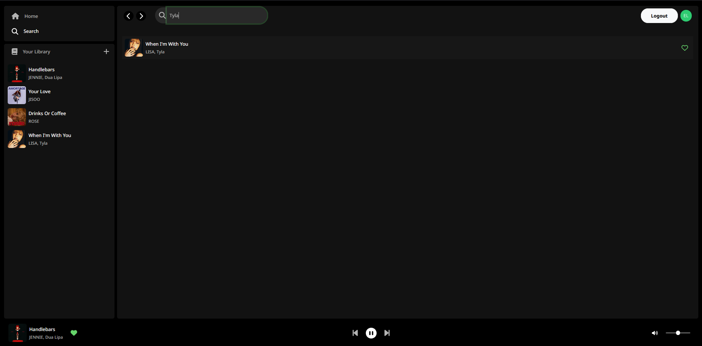

# Spotify Clone

## Description

This project aims to create a Spotify clone, with a backend developed in **Spring Boot 3**, a frontend in **Angular 17**, modern design using **Bootstrap 5**, a **PostgreSQL** database, and authentication management via **Auth0**.

The application allows users to upload music tracks, stream them, search for songs, and manage their favorite tracks. This project is designed to be a robust and modern full-stack application, showcasing skills in widely used technologies today.

### Key Features

- **Secure Authentication with Auth0 (OAuth2)**: User authentication management.


- **Upload music**: Enables users to upload music tracks.


- **Audio Streaming**: Music streaming functionality.


- **Music Search**: Allows users to search for songs in the library.



- **Favourite songs management**: Users can add tracks to their favorites.


- **Responsive UI with Bootstrap 5**: User interface optimized for all devices.

- **New Angular Features**: Utilizes Angular 17's standalone components, Signals, and new control flow syntax.

## Project Structure

The project is divided into two main parts:

### 1. **Frontend (Angular 17)**

The frontend is developed using **Angular 17** and designed with **Bootstrap 5**. The application is responsive, ensuring smooth usage across all device types.

**Frontend Directory**: `spotify-clone-front`

- **Technologies Used**: Angular 17, Bootstrap 5
- **Authentication**: Auth0 for securing user access
- **Components**: Signals, Standalone components
- **Features**:
  - Music upload
  - Display of music tracks
  - Favorites management
  - Music search

#### Usage

##### Prerequisites
- NodeJS 20.11 LTS
- Angular CLI v17
- IDE (VSCode, IntelliJ, Webstorm)

##### Fetch Dependencies

```bash
npm install
```

##### Launch Development Server
Run `ng serve` for a development server. Navigate to http://localhost:4200/. The application will automatically reload if you change any of the source files.

##### Build
Run `ng build` to build the project. The build artifacts will be stored in the `dist/` directory.

---

### 2. **Backend (Spring Boot 3)**

The backend is built with **Spring Boot 3** and uses **PostgreSQL** as the database. It handles the application's logic, user management, music uploads, and search functionality.

**Backend Directory**: `spotify-clone-back`

- **Technologies Used**: Spring Boot 3, PostgreSQL, Auth0 for authentication
- **Features**:
  - User and authentication management
  - File upload and storage for music tracks
  - Audio streaming
  - Search and favorites management

#### Usage

##### Prerequisites
- JDK 21
- IDE (VSCode, IntelliJ)
- PostgreSQL

##### Setup `.env` File
Create a `.env` file at the root of the project with the following content:

```
POSTGRES_USERNAME= 
POSTGRES_PASSWORD=
POSTGRES_URL=
POSTGRES_DB=

ISSUER=
AUTH0_CLIENT_ID=
AUTH0_CLIENT_SECRET=
```

##### Fetch Dependencies

```bash
./mvnw install -Dmaven.test.skip=true
```

##### Launch Application
Open your IDE, add the `.env` file to the environment variables, and then run the application.
